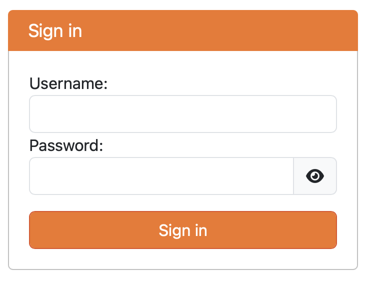

# Starting the Hub

## Start JupyterHub

In a terminal, type:

```bash
jupyterhub --Authenticator.allow_all=True
```

or

```bash
jupyterhub --port 8080 --Authenticator.allow_all=True
```

to run jupyterhub on a port.

### What happened?

We started JupyterHub! It's running on the port we specified, or 8000 by default if you didn't specify.
It's using _almost_ all the default configuration, which should work.

```{note}
To get started, we set _one_ option, [Authenticator.allow_all](xref:jupyterhub#jupyterhub.auth.Authenticator.allow_all),
which means that any user who successfully authenticates will be allowed access.
This is because nobody is allowed access to JupyterHub by default,
only those _explicitly allowed_.
We are starting with: every user on this system.

We will do this more deliberately later on,
when we [create a config file](#config-file).
```

Open the port specified, e.g. `http://127.0.0.1:8000` if you ran it on the machine you are looking at,
or the public IP if it is a remote machine.

You should see a login form that looks like this:



## Authenticate with the Hub

We are now faced with a username and password.
But what username and password?

JupyterHub uses something called an [Authenticator](xref:jupyterhub#jupyterhub.auth.Authenticator)
that defines how users login.
Generally, these defer to an external identity provider
such as your local system or institution.

The default Authenticator that comes with JupyterHub
uses [PAM](https://en.wikipedia.org/wiki/Pluggable_authentication_module),
which is the authentication mechanism for your local machine.
This means that the information you need to enter
is your username and password for the machine.

```{warning}
If you are connecting to the Hub over the network and not yet using HTTPS or SSH tunnels to secure your connection to the Hub machine,
your password will be sent in the clear.
If this is the case, make sure you are using a throwaway password that you change soon (or the VM will be destroyed).
```

````{note}
If you don't have any password set yet (e.g. you setup a cloud VM with only SSH key access), you can create a password for your user with

```bash
sudo passwd $USERNAME
```

````

**What happened?**

JupyterHub has

- relayed your username and password to PAM to **authenticate** that you are really you
- received from PAM that your username and password are correct
- checked your username against the **allowed users**, which we set to: everybody who can successfully login with PAM

you will see this progress page:

TODO: screenshot of progress page

after a short period, you should see the familiar JupyterLab UI.

TODO: screenshot of your server

**What happened?**

JupyterHub has

- relayed your username and password to PAM to verify that you are you
- created a JupyterHub user with the given username
- requested that the system launch a server using a Spawner (more later) *as* you

## Explore the Hub and its User Interface

### View JupyterHub log in the terminal

Proxy is started when typing `jupyterhub`.
In this case, `configurable-http-proxy` is started.

TODO: log snippets

### Unpack the URL

TODO: Explain: server/user/username/tree

### Start and Stop a user's notebook server

```
- Start and Stop Server for the User
```

### Stop JupyterHub

Control-C in the terminal to stop JupyterHub

______________________________________________________________________

## Key Concepts

- JupyterHub is not significantly different than Jupyter notebook and JupyterLab. It's a tool for deploying web-based applications on behalf of users.
- JupyterHub relies on three major building blocks:
  - a **proxy** to route network traffic
  - an **authenticator** to verify users should be able to access the hub
  - a **spawner** which is responsible for creating a single user notebook server for each user
- The deployment to this point uses:
  - the [configurable-http-proxy](https://github.com/jupyterhub/configurable-http-proxy) to route the user to the hub for authentication.
  - the [default Authenticator](xref:jupyterhub#jupyterhub.auth.PAMAuthenticator) which uses PAM and a username and password to
    authenticates a user
    - All users (`allow_all=True`)
  - The [default spawner](xref:jupyterhub#jupyterhub.spawner.LocalProcessSpawner), a local process spawner, which the hub directs to spawns a notebook server for each user as a local process.
- At this point, no admin stuff has been discussed.

______________________________________________________________________

## Extend your learning

Modification: Set up an ssh tunnel [See assumptions above]

______________________________________________________________________

Next: [Creating a JupyterHub Configuration File](04-generate-jupyterhub-config-file.md)
